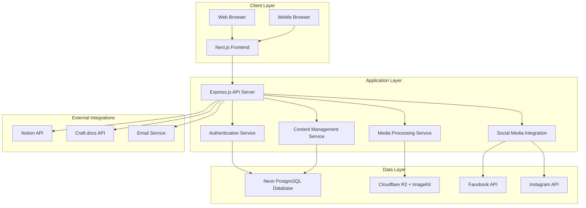

# Design Document

## Overview

The ONS WebApp is designed as a modern, scalable web application that serves as a centralized platform for the Oulu Nepalese Sport community. The system follows a modular architecture with clear separation between public content, member-exclusive features, and administrative functions. The design prioritizes mobile-first responsive design, performance, and user experience while maintaining security and scalability.

## Architecture

### System Architecture Pattern

The application follows a **Modern Separated Frontend/Backend Architecture** optimized for cost-effectiveness and developer experience:

**Frontend Stack:**
- **Framework**: Next.js 14+ with React 18+ for server-side rendering and optimal SEO
- **Styling**: Tailwind CSS for rapid UI development
- **State Management**: React Query for server state, Zustand for client state
- **Deployment**: Cloudflare Pages for fast global delivery with zero-cost hosting

**Backend Stack:**
- **API Server**: Express.js with Node.js for RESTful API endpoints
- **Database**: Neon PostgreSQL with generous free tier and serverless scaling
- **ORM**: Prisma for type-safe database operations and migrations
- **Authentication**: WorkOS for enterprise-grade auth with social login support
- **Deployment**: Render or Fly.io for containerized Express.js deployment

**Storage & Media:**
- **File Storage**: Cloudflare R2 for zero-egress cost object storage
- **Media Optimization**: ImageKit for automatic image resizing, optimization, and CDN
- **CDN**: Global content delivery through ImageKit and Cloudflare network

**External Integrations:**
- **Social Media**: Facebook Graph API and Instagram Basic Display API
- **Document Management**: Notion API and Craft.docs integration
- **Email**: Resend or SendGrid for transactional emails
- **Monitoring**: Sentry for error tracking, Vercel Analytics for performance

### High-Level Architecture Diagram



## Components and Interfaces

### Frontend Component Architecture

#### 1. Layout Components

**MainLayout Component**
- Responsive navigation header with language switcher
- Footer with organization information
- Mobile-first hamburger menu
- Breadcrumb navigation for deep pages

**AuthLayout Component**
- Simplified layout for login/registration pages
- Centered form design with ONS branding
- Social login integration buttons

#### 2. Public Content Components

**AnnouncementCard Component**
```typescript
interface AnnouncementCardProps {
  id: string;
  title: string;
  image: string;
  priority: number;
  createdAt: Date;
  onClick: () => void;
}
```

**NewsCard Component**
```typescript
interface NewsCardProps {
  id: string;
  title: string;
  featuredImage: string;
  slug: string;
  isPublished: boolean;
}
```

**EventCard Component**
```typescript
interface EventCardProps {
  id: string;
  title: string;
  date: Date;
  time: string;
  location: string;
  description: string;
  registrationEnabled: boolean;
  maxParticipants?: number;
  currentParticipants: number;
}
```

**EventRegistrationForm Component**
```typescript
interface EventRegistrationFormProps {
  eventId: string;
  onSubmit: (data: RegistrationData) => Promise<void>;
  isLoading: boolean;
}

interface RegistrationData {
  name: string;
  email: string;
  phone?: string;
  dietaryRestrictions?: string;
  emergencyContact?: string;
}
```

#### 3. Member-Exclusive Components

**PhotoGallery Component**
```typescript
interface PhotoGalleryProps {
  eventId: string;
  photos: Photo[];
  onDownload: (photoId: string) => void;
  onTag: (photoId: string, tags: string[]) => void;
}

interface Photo {
  id: string;
  url: string;
  thumbnail: string;
  tags: string[];
  uploadedBy: string;
  uploadedAt: Date;
}
```

**VideoGallery Component**
```typescript
interface VideoGalleryProps {
  videos: Video[];
  autoPlay: boolean;
  onVideoEnd: (videoId: string) => void;
}

interface Video {
  id: string;
  url: string;
  thumbnail: string;
  duration: number;
  uploadedBy: string;
  expiresAt?: Date;
}
```

#### 4. Content Management Components

**RichTextEditor Component**
- Integration with TinyMCE or similar WYSIWYG editor
- Media embedding capabilities
- Draft/publish workflow controls
- Version history display

**MediaUploader Component**
```typescript
interface MediaUploaderProps {
  onUpload: (files: File[]) => Promise<UploadResult[]>;
  acceptedTypes: string[];
  maxFileSize: number;
  multiple: boolean;
}

interface UploadResult {
  id: string;
  url: string;
  filename: string;
  size: number;
  type: string;
}
```

### Backend API Design

#### 1. Authentication APIs (Express.js Routes)

```typescript
// POST /api/auth/register
interface RegisterRequest {
  email: string;
  password: string;
  name: string;
  phone?: string;
}

// POST /api/auth/login
interface LoginRequest {
  email: string;
  password: string;
  rememberMe?: boolean;
}

// POST /api/auth/reset-password
interface ResetPasswordRequest {
  email: string;
}

// Express.js Route Structure with WorkOS
app.post('/api/auth/workos-callback', workosCallbackController);
app.get('/api/auth/login/:provider', workosLoginController);
app.post('/api/auth/logout', logoutController);
app.get('/api/auth/profile', authenticateMiddleware, profileController);
```

#### 2. Content Management APIs

```typescript
// GET /api/announcements
interface AnnouncementResponse {
  id: string;
  title: string;
  content: string;
  image: string;
  priority: number;
  isActive: boolean;
  createdAt: Date;
  updatedAt: Date;
}

// GET /api/news
interface NewsResponse {
  id: string;
  title: string;
  content: string;
  featuredImage: string;
  slug: string;
  isPublished: boolean;
  publishedAt?: Date;
  author: {
    id: string;
    name: string;
  };
}

// GET /api/events
interface EventResponse {
  id: string;
  title: string;
  description: string;
  date: Date;
  time: string;
  location: string;
  maxParticipants?: number;
  registrationDeadline?: Date;
  registrations: EventRegistration[];
}
```

#### 3. Media Management APIs

```typescript
// POST /api/media/upload
interface MediaUploadRequest {
  files: File[];
  category: 'photo' | 'video' | 'document';
  eventId?: string;
  tags?: string[];
}

// GET /api/media/gallery/:eventId
interface GalleryResponse {
  photos: Photo[];
  videos: Video[];
  totalCount: number;
  hasMore: boolean;
}
```

#### 4. Social Media Integration APIs

```typescript
// POST /api/social/publish
interface SocialPublishRequest {
  contentId: string;
  platforms: ('facebook' | 'instagram')[];
  scheduledAt?: Date;
  customMessage?: string;
}

// GET /api/social/status/:publishId
interface SocialPublishStatus {
  id: string;
  status: 'pending' | 'published' | 'failed';
  platforms: {
    platform: string;
    status: string;
    publishedAt?: Date;
    error?: string;
  }[];
}
```

## Data Models

### Core Data Models

#### User Model
```typescript
interface User {
  id: string;
  email: string;
  passwordHash: string;
  name: string;
  phone?: string;
  profileImage?: string;
  role: 'visitor' | 'member' | 'editor' | 'admin';
  isActive: boolean;
  emailVerified: boolean;
  lastLoginAt?: Date;
  createdAt: Date;
  updatedAt: Date;
  
  // Relations
  eventRegistrations: EventRegistration[];
  uploadedMedia: Media[];
  createdContent: Content[];
}
```

#### Content Model
```typescript
interface Content {
  id: string;
  type: 'announcement' | 'news' | 'event';
  title: string;
  content: string;
  slug: string;
  featuredImage?: string;
  isPublished: boolean;
  publishedAt?: Date;
  scheduledAt?: Date;
  priority?: number; // For announcements
  authorId: string;
  createdAt: Date;
  updatedAt: Date;
  
  // Relations
  author: User;
  media: Media[];
  translations: ContentTranslation[];
  socialPosts: SocialPost[];
}
```

#### Event Model
```typescript
interface Event extends Content {
  date: Date;
  time: string;
  location: string;
  maxParticipants?: number;
  registrationDeadline?: Date;
  registrationEnabled: boolean;
  
  // Relations
  registrations: EventRegistration[];
  gallery: Media[];
}
```

#### Media Model
```typescript
interface Media {
  id: string;
  filename: string;
  originalName: string;
  url: string;
  thumbnailUrl?: string;
  type: 'image' | 'video' | 'document';
  size: number;
  mimeType: string;
  tags: string[];
  eventId?: string;
  uploadedById: string;
  isPublic: boolean;
  createdAt: Date;
  
  // Relations
  uploadedBy: User;
  event?: Event;
}
```

#### EventRegistration Model
```typescript
interface EventRegistration {
  id: string;
  eventId: string;
  userId?: string; // Optional for guest registrations
  name: string;
  email: string;
  phone?: string;
  dietaryRestrictions?: string;
  emergencyContact?: string;
  status: 'pending' | 'confirmed' | 'cancelled';
  registeredAt: Date;
  
  // Relations
  event: Event;
  user?: User;
}
```

### Database Schema Design

The database will use Neon PostgreSQL with the following key design decisions:

1. **UUID Primary Keys**: For better security and distributed system compatibility
2. **Soft Deletes**: Using `deletedAt` timestamp for content that should be archived
3. **Audit Trails**: `createdAt` and `updatedAt` timestamps on all models
4. **Indexing Strategy**: Composite indexes on frequently queried combinations
5. **JSON Fields**: For flexible metadata storage (tags, settings, etc.)

## Error Handling

### Frontend Error Handling

#### Error Boundary Component
```typescript
interface ErrorBoundaryState {
  hasError: boolean;
  error?: Error;
  errorInfo?: ErrorInfo;
}

class ErrorBoundary extends Component<PropsWithChildren, ErrorBoundaryState> {
  // Catches JavaScript errors anywhere in child component tree
  // Displays fallback UI and logs errors for monitoring
}
```

#### API Error Handling
```typescript
interface ApiError {
  code: string;
  message: string;
  details?: Record<string, any>;
  timestamp: Date;
}

// Centralized error handling with user-friendly messages
const handleApiError = (error: ApiError) => {
  switch (error.code) {
    case 'UNAUTHORIZED':
      // Redirect to login
      break;
    case 'VALIDATION_ERROR':
      // Show form validation errors
      break;
    case 'RATE_LIMIT_EXCEEDED':
      // Show rate limit message
      break;
    default:
      // Show generic error message
  }
};
```

### Backend Error Handling

#### Standardized Error Response Format
```typescript
interface ErrorResponse {
  success: false;
  error: {
    code: string;
    message: string;
    details?: Record<string, any>;
  };
  timestamp: Date;
  requestId: string;
}
```

#### Error Categories
1. **Validation Errors**: Input validation failures with field-specific messages
2. **Authentication Errors**: Login failures, token expiration, insufficient permissions
3. **Business Logic Errors**: Domain-specific errors (event full, registration closed)
4. **System Errors**: Database failures, external API failures, server errors
5. **Rate Limiting**: API rate limit exceeded errors

## Testing Strategy

### Frontend Testing

#### Unit Testing
- **Framework**: Jest + React Testing Library
- **Coverage Target**: 80% code coverage
- **Focus Areas**: Component logic, utility functions, custom hooks

#### Integration Testing
- **Framework**: Cypress or Playwright
- **Scenarios**: User workflows, form submissions, navigation flows
- **API Mocking**: Mock Service Worker (MSW) for API responses

#### Visual Testing
- **Framework**: Storybook + Chromatic
- **Components**: All reusable UI components
- **Responsive Testing**: Multiple viewport sizes

### Backend Testing

#### Unit Testing
- **Framework**: Jest + Supertest
- **Coverage Target**: 85% code coverage
- **Focus Areas**: API endpoints, business logic, utility functions

#### Integration Testing
- **Database Testing**: Test database with Docker containers
- **External API Testing**: Mock external services (social media APIs, Notion)
- **Authentication Testing**: JWT token validation, role-based access

#### Performance Testing
- **Load Testing**: Artillery.js for API endpoint performance
- **Database Performance**: Query performance monitoring
- **Memory Usage**: Node.js memory profiling

### End-to-End Testing

#### User Journey Testing
1. **Public User Journey**: Browse content → Register for event → Submit contact form
2. **Member Journey**: Login → View galleries → Download photos
3. **Editor Journey**: Login → Create content → Schedule social media post
4. **Admin Journey**: User management → Content approval → System monitoring

#### Cross-Browser Testing
- **Browsers**: Chrome, Firefox, Safari, Edge
- **Mobile Testing**: iOS Safari, Android Chrome
- **Accessibility Testing**: Screen reader compatibility, keyboard navigation

## Security Considerations

### Authentication & Authorization

#### WorkOS Authentication
- **Password Security**: Managed by WorkOS with enterprise-grade security standards
- **OAuth Providers**: Google, Facebook, and other social login options through WorkOS
- **Password Policy**: Configurable through WorkOS dashboard
- **Account Security**: Multi-factor authentication support, account lockout policies

#### Session Management
- **WorkOS Sessions**: Secure session management handled by WorkOS
- **JWT Tokens**: WorkOS-issued tokens with proper expiration and refresh
- **Secure Cookies**: WorkOS handles secure cookie management
- **SSO Support**: Single Sign-On capabilities for organization members

### Data Protection

#### Input Validation
- **Server-Side Validation**: All inputs validated on backend
- **Sanitization**: HTML content sanitized to prevent XSS
- **File Upload Security**: File type validation, size limits, virus scanning
- **Cloudflare R2 Storage**: Secure object storage with encryption at rest and zero egress costs
- **ImageKit Integration**: Automatic image optimization, resizing, and global CDN delivery
- **SQL Injection Prevention**: Parameterized queries with Prisma ORM

#### Data Encryption
- **In Transit**: HTTPS/TLS 1.3 for all communications
- **At Rest**: Database encryption for sensitive data
- **File Storage**: Encrypted storage for uploaded media
- **API Keys**: Secure storage and rotation of external API keys

### GDPR Compliance

#### Data Minimization
- **Collection**: Only collect necessary user data
- **Retention**: Automatic data deletion after specified periods
- **Purpose Limitation**: Data used only for stated purposes
- **Storage Limitation**: Regular cleanup of unused data

#### User Rights
- **Data Export**: Users can download their data in JSON format
- **Data Deletion**: Complete account and data deletion capability
- **Consent Management**: Clear consent for data processing
- **Privacy Policy**: Comprehensive privacy policy with regular updates

This design provides a solid foundation for implementing the ONS WebApp with all the required functionality while maintaining scalability, security, and user experience standards.