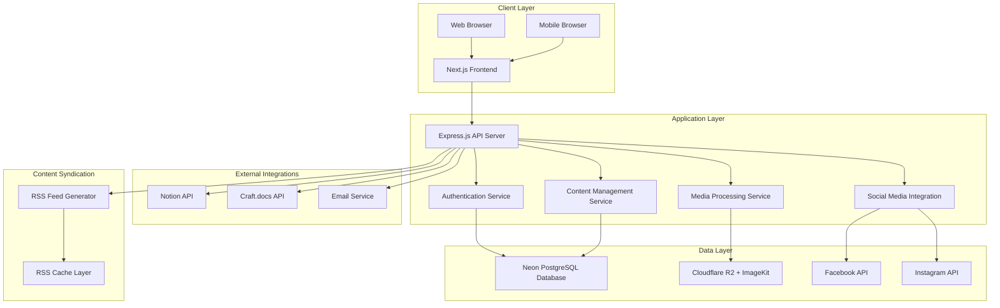

# Design Document

## Overview

The ONS WebApp is designed as a modern, visually stunning web application that serves as the digital hub for the Oulu Nepalese Sport community. The redesigned system emphasizes contemporary UI/UX patterns, engaging visual design, and seamless user interactions. The architecture maintains modular separation between public content, member-exclusive features, and administrative functions while introducing a comprehensive design system, modern component library, and enhanced user experience patterns. The design prioritizes mobile-first responsive design, visual appeal, micro-interactions, and performance optimization.

## Architecture

### System Architecture Pattern

The application follows a **Modern Separated Frontend/Backend Architecture** optimized for cost-effectiveness and developer experience:

**Frontend Stack:**
- **Framework**: Next.js 14+ with React 18+ for server-side rendering and optimal SEO
- **Styling**: Tailwind CSS for rapid UI development
- **State Management**: React Query for server state, Zustand for client state
- **Deployment**: Cloudflare Pages for fast global delivery with zero-cost hosting

**Backend Stack:**
- **API Server**: Express.js with Node.js for RESTful API endpoints
- **Database**: Neon PostgreSQL with generous free tier and serverless scaling
- **ORM**: Prisma for type-safe database operations and migrations
- **Authentication**: WorkOS for enterprise-grade auth with social login support
- **Deployment**: Render or Fly.io for containerized Express.js deployment

**Storage & Media:**
- **File Storage**: Cloudflare R2 for zero-egress cost object storage
- **Media Optimization**: ImageKit for automatic image resizing, optimization, and CDN
- **CDN**: Global content delivery through ImageKit and Cloudflare network

**External Integrations:**
- **Social Media**: Facebook Graph API and Instagram Basic Display API
- **Document Management**: Notion API and Craft.docs integration
- **Email**: Resend or SendGrid for transactional emails
- **RSS Syndication**: RSS 2.0 feed generation with caching layer
- **Monitoring**: Sentry for error tracking, Vercel Analytics for performance

### High-Level Architecture Diagram



## Comprehensive Modern UI Design System

### Enhanced Brand Identity and Color Palette

#### Primary Brand Colors with Gradients and Modern Effects
```css
:root {
  /* Primary ONS Colors with Gradient Support */
  --ons-primary: #1e40af;
  --ons-primary-light: #3b82f6;
  --ons-primary-dark: #1e3a8a;
  --ons-primary-gradient: linear-gradient(135deg, #1e40af 0%, #3b82f6 100%);
  --ons-primary-gradient-hover: linear-gradient(135deg, #1e3a8a 0%, #1e40af 100%);
  
  /* Secondary Colors with Vibrant Palette */
  --ons-secondary: #dc2626;
  --ons-secondary-light: #ef4444;
  --ons-secondary-gradient: linear-gradient(135deg, #dc2626 0%, #ef4444 100%);
  
  /* Accent Colors for Visual Interest */
  --ons-accent-purple: #8b5cf6;
  --ons-accent-teal: #14b8a6;
  --ons-accent-orange: #f97316;
  --ons-accent-pink: #ec4899;
  
  /* Enhanced Neutral Colors with WCAG AA Compliance */
  --ons-gray-50: #f9fafb;
  --ons-gray-100: #f3f4f6;
  --ons-gray-200: #e5e7eb;
  --ons-gray-300: #d1d5db;
  --ons-gray-400: #9ca3af;
  --ons-gray-500: #6b7280;
  --ons-gray-600: #4b5563;
  --ons-gray-700: #374151;
  --ons-gray-800: #1f2937;
  --ons-gray-900: #111827;
  
  /* Semantic Colors with High Contrast */
  --ons-success: #10b981;
  --ons-success-light: #34d399;
  --ons-warning: #f59e0b;
  --ons-warning-light: #fbbf24;
  --ons-error: #ef4444;
  --ons-error-light: #f87171;
  --ons-info: #3b82f6;
  --ons-info-light: #60a5fa;
  
  /* Dark Mode Support */
  --ons-dark-bg: #0f172a;
  --ons-dark-surface: #1e293b;
  --ons-dark-surface-hover: #334155;
  --ons-dark-text: #f1f5f9;
  --ons-dark-text-muted: #94a3b8;
  
  /* Glassmorphism Effects */
  --glass-bg: rgba(255, 255, 255, 0.1);
  --glass-border: rgba(255, 255, 255, 0.2);
  --glass-backdrop: blur(10px);
  --glass-dark-bg: rgba(15, 23, 42, 0.8);
  --glass-dark-border: rgba(255, 255, 255, 0.1);
}
```

#### Advanced Shadow and Depth System
```css
/* Subtle Depth Effects */
--shadow-xs: 0 1px 2px 0 rgb(0 0 0 / 0.05);
--shadow-sm: 0 1px 3px 0 rgb(0 0 0 / 0.1), 0 1px 2px -1px rgb(0 0 0 / 0.1);
--shadow-md: 0 4px 6px -1px rgb(0 0 0 / 0.1), 0 2px 4px -2px rgb(0 0 0 / 0.1);
--shadow-lg: 0 10px 15px -3px rgb(0 0 0 / 0.1), 0 4px 6px -4px rgb(0 0 0 / 0.1);
--shadow-xl: 0 20px 25px -5px rgb(0 0 0 / 0.1), 0 8px 10px -6px rgb(0 0 0 / 0.1);
--shadow-2xl: 0 25px 50px -12px rgb(0 0 0 / 0.25);

/* Colored Shadows for Brand Elements */
--shadow-primary: 0 10px 15px -3px rgb(30 64 175 / 0.3), 0 4px 6px -4px rgb(30 64 175 / 0.3);
--shadow-secondary: 0 10px 15px -3px rgb(220 38 38 / 0.3), 0 4px 6px -4px rgb(220 38 38 / 0.3);

/* Neumorphism Support */
--shadow-inner: inset 0 2px 4px 0 rgb(0 0 0 / 0.05);
--shadow-inner-lg: inset 0 4px 8px 0 rgb(0 0 0 / 0.1);
--shadow-neumorphism: 8px 8px 16px #d1d9e6, -8px -8px 16px #ffffff;
--shadow-neumorphism-inset: inset 8px 8px 16px #d1d9e6, inset -8px -8px 16px #ffffff;
```

#### Bold, Readable Typography System
```css
/* Modern Font Stack with Variable Fonts */
--font-primary: 'Inter Variable', 'Inter', -apple-system, BlinkMacSystemFont, sans-serif;
--font-heading: 'Poppins', 'Inter Variable', -apple-system, BlinkMacSystemFont, sans-serif;
--font-mono: 'JetBrains Mono', 'Fira Code', 'Monaco', 'Cascadia Code', monospace;

/* Responsive Font Sizes with Fluid Typography */
--text-xs: clamp(0.7rem, 0.66rem + 0.2vw, 0.75rem);      /* 11-12px */
--text-sm: clamp(0.8rem, 0.74rem + 0.3vw, 0.875rem);     /* 13-14px */
--text-base: clamp(0.9rem, 0.83rem + 0.35vw, 1rem);      /* 14-16px */
--text-lg: clamp(1rem, 0.91rem + 0.43vw, 1.125rem);      /* 16-18px */
--text-xl: clamp(1.1rem, 0.98rem + 0.61vw, 1.25rem);     /* 18-20px */
--text-2xl: clamp(1.3rem, 1.15rem + 0.74vw, 1.5rem);     /* 21-24px */
--text-3xl: clamp(1.6rem, 1.36rem + 1.18vw, 1.875rem);   /* 26-30px */
--text-4xl: clamp(2rem, 1.65rem + 1.74vw, 2.25rem);      /* 32-36px */
--text-5xl: clamp(2.5rem, 2.04rem + 2.3vw, 3rem);        /* 40-48px */
--text-6xl: clamp(3rem, 2.43rem + 2.87vw, 3.75rem);      /* 48-60px */

/* Enhanced Font Weights */
--font-thin: 100;
--font-extralight: 200;
--font-light: 300;
--font-normal: 400;
--font-medium: 500;
--font-semibold: 600;
--font-bold: 700;
--font-extrabold: 800;
--font-black: 900;

/* Line Heights for Readability */
--leading-tight: 1.25;
--leading-snug: 1.375;
--leading-normal: 1.5;
--leading-relaxed: 1.625;
--leading-loose: 2;

/* Letter Spacing */
--tracking-tighter: -0.05em;
--tracking-tight: -0.025em;
--tracking-normal: 0em;
--tracking-wide: 0.025em;
--tracking-wider: 0.05em;
--tracking-widest: 0.1em;
```

#### Minimalist Layout with Clear Hierarchy
```css
/* Enhanced Spacing Scale for Clear Hierarchy */
--space-px: 1px;
--space-0: 0;
--space-0-5: 0.125rem;  /* 2px */
--space-1: 0.25rem;     /* 4px */
--space-1-5: 0.375rem;  /* 6px */
--space-2: 0.5rem;      /* 8px */
--space-2-5: 0.625rem;  /* 10px */
--space-3: 0.75rem;     /* 12px */
--space-3-5: 0.875rem;  /* 14px */
--space-4: 1rem;        /* 16px */
--space-5: 1.25rem;     /* 20px */
--space-6: 1.5rem;      /* 24px */
--space-7: 1.75rem;     /* 28px */
--space-8: 2rem;        /* 32px */
--space-9: 2.25rem;     /* 36px */
--space-10: 2.5rem;     /* 40px */
--space-11: 2.75rem;    /* 44px */
--space-12: 3rem;       /* 48px */
--space-14: 3.5rem;     /* 56px */
--space-16: 4rem;       /* 64px */
--space-20: 5rem;       /* 80px */
--space-24: 6rem;       /* 96px */
--space-28: 7rem;       /* 112px */
--space-32: 8rem;       /* 128px */

/* Rounded Corners and Soft Edges */
--radius-none: 0;
--radius-sm: 0.125rem;   /* 2px */
--radius-md: 0.375rem;   /* 6px */
--radius-lg: 0.5rem;     /* 8px */
--radius-xl: 0.75rem;    /* 12px */
--radius-2xl: 1rem;      /* 16px */
--radius-3xl: 1.5rem;    /* 24px */
--radius-full: 9999px;

/* Container Sizes for Responsive Design */
--container-sm: 640px;
--container-md: 768px;
--container-lg: 1024px;
--container-xl: 1280px;
--container-2xl: 1536px;

/* Z-Index Scale for Layering */
--z-0: 0;
--z-10: 10;
--z-20: 20;
--z-30: 30;
--z-40: 40;
--z-50: 50;
--z-auto: auto;
```

### Advanced Animation and Interaction System

#### Smooth Hover and Click Animations
```css
/* Transition Durations */
--duration-75: 75ms;
--duration-100: 100ms;
--duration-150: 150ms;
--duration-200: 200ms;
--duration-300: 300ms;
--duration-500: 500ms;
--duration-700: 700ms;
--duration-1000: 1000ms;

/* Advanced Easing Functions */
--ease-linear: linear;
--ease-in: cubic-bezier(0.4, 0, 1, 1);
--ease-out: cubic-bezier(0, 0, 0.2, 1);
--ease-in-out: cubic-bezier(0.4, 0, 0.2, 1);
--ease-bounce: cubic-bezier(0.68, -0.55, 0.265, 1.55);
--ease-elastic: cubic-bezier(0.175, 0.885, 0.32, 1.275);
--ease-back: cubic-bezier(0.68, -0.6, 0.32, 1.6);

/* Transform Utilities */
--scale-0: 0;
--scale-50: 0.5;
--scale-75: 0.75;
--scale-90: 0.9;
--scale-95: 0.95;
--scale-100: 1;
--scale-105: 1.05;
--scale-110: 1.1;
--scale-125: 1.25;
--scale-150: 1.5;

/* Rotation Values */
--rotate-0: 0deg;
--rotate-1: 1deg;
--rotate-2: 2deg;
--rotate-3: 3deg;
--rotate-6: 6deg;
--rotate-12: 12deg;
--rotate-45: 45deg;
--rotate-90: 90deg;
--rotate-180: 180deg;
```

#### Comprehensive Keyframe Animations
```css
/* Loading and Progress Animations */
@keyframes spin {
  from { transform: rotate(0deg); }
  to { transform: rotate(360deg); }
}

@keyframes pulse {
  0%, 100% { opacity: 1; }
  50% { opacity: 0.5; }
}

@keyframes bounce {
  0%, 100% { 
    transform: translateY(-25%);
    animation-timing-function: cubic-bezier(0.8, 0, 1, 1);
  }
  50% { 
    transform: translateY(0);
    animation-timing-function: cubic-bezier(0, 0, 0.2, 1);
  }
}

/* Entrance Animations */
@keyframes fadeIn {
  from { opacity: 0; }
  to { opacity: 1; }
}

@keyframes slideInUp {
  from { 
    opacity: 0;
    transform: translateY(100%);
  }
  to { 
    opacity: 1;
    transform: translateY(0);
  }
}

@keyframes slideInDown {
  from { 
    opacity: 0;
    transform: translateY(-100%);
  }
  to { 
    opacity: 1;
    transform: translateY(0);
  }
}

@keyframes slideInLeft {
  from { 
    opacity: 0;
    transform: translateX(-100%);
  }
  to { 
    opacity: 1;
    transform: translateX(0);
  }
}

@keyframes slideInRight {
  from { 
    opacity: 0;
    transform: translateX(100%);
  }
  to { 
    opacity: 1;
    transform: translateX(0);
  }
}

@keyframes scaleIn {
  from { 
    opacity: 0;
    transform: scale(0.9);
  }
  to { 
    opacity: 1;
    transform: scale(1);
  }
}

/* Shimmer Effect for Loading States */
@keyframes shimmer {
  0% { background-position: -200px 0; }
  100% { background-position: calc(200px + 100%) 0; }
}

/* Floating Animation for CTAs */
@keyframes float {
  0%, 100% { transform: translateY(0px); }
  50% { transform: translateY(-10px); }
}

/* Gradient Animation for Backgrounds */
@keyframes gradientShift {
  0% { background-position: 0% 50%; }
  50% { background-position: 100% 50%; }
  100% { background-position: 0% 50%; }
}
```

#### Visual Feedback for User Actions
```css
/* Button Interaction States */
.btn-primary {
  background: var(--ons-primary-gradient);
  transition: all var(--duration-200) var(--ease-out);
  transform: translateY(0);
  box-shadow: var(--shadow-md);
}

.btn-primary:hover {
  background: var(--ons-primary-gradient-hover);
  transform: translateY(-2px);
  box-shadow: var(--shadow-lg);
}

.btn-primary:active {
  transform: translateY(0);
  box-shadow: var(--shadow-sm);
}

/* Card Hover Effects */
.card {
  transition: all var(--duration-300) var(--ease-out);
  transform: translateY(0);
  box-shadow: var(--shadow-sm);
}

.card:hover {
  transform: translateY(-4px);
  box-shadow: var(--shadow-xl);
}

/* Input Focus States */
.input {
  transition: all var(--duration-200) var(--ease-out);
  border-color: var(--ons-gray-300);
  box-shadow: 0 0 0 0 var(--ons-primary);
}

.input:focus {
  border-color: var(--ons-primary);
  box-shadow: 0 0 0 3px rgba(30, 64, 175, 0.1);
}
```

### Modern UI Component Specifications

#### Card-Based UI Components
```typescript
interface ModernCardProps {
  variant: 'elevated' | 'outlined' | 'filled' | 'glass';
  size: 'sm' | 'md' | 'lg' | 'xl';
  interactive?: boolean;
  loading?: boolean;
  children: React.ReactNode;
  className?: string;
  onClick?: () => void;
}
```
- Elevated cards with subtle shadows and hover effects
- Glass-morphism variant with backdrop blur
- Interactive cards with scale and shadow transitions
- Loading states with skeleton placeholders
- Consistent padding and border radius

#### Sticky Headers and Floating Action Buttons
```typescript
interface StickyHeaderProps {
  transparent?: boolean;
  blurBackground?: boolean;
  showOnScroll?: boolean;
  children: React.ReactNode;
}

interface FloatingActionButtonProps {
  icon: React.ReactNode;
  label?: string;
  position: 'bottom-right' | 'bottom-left' | 'top-right' | 'top-left';
  size: 'sm' | 'md' | 'lg';
  variant: 'primary' | 'secondary';
  onClick: () => void;
  badge?: number;
}
```
- Headers with scroll-based opacity and blur effects
- FABs with material design elevation and ripple effects
- Smooth show/hide animations based on scroll direction
- Badge support for notifications

#### High-Resolution Imagery with Optimization
```typescript
interface OptimizedImageProps {
  src: string;
  alt: string;
  width?: number;
  height?: number;
  quality?: number;
  placeholder?: 'blur' | 'empty';
  blurDataURL?: string;
  priority?: boolean;
  sizes?: string;
  className?: string;
}
```
- Next.js Image component with automatic optimization
- WebP and AVIF format support
- Blur hash placeholders for progressive loading
- Responsive image sizing with srcset
- Lazy loading with intersection observer

#### Custom Illustrations and Avatars
```typescript
interface AvatarProps {
  src?: string;
  alt?: string;
  size: 'xs' | 'sm' | 'md' | 'lg' | 'xl' | '2xl';
  shape: 'circle' | 'square' | 'rounded';
  fallback?: string;
  status?: 'online' | 'offline' | 'away' | 'busy';
  border?: boolean;
  className?: string;
}

interface IllustrationProps {
  name: string;
  size?: number;
  color?: string;
  animated?: boolean;
  className?: string;
}
```
- Avatar component with fallback initials
- Status indicators with animated dots
- Custom SVG illustrations with animation support
- Consistent sizing and styling across the app

## Components and Interfaces

### Frontend Component Architecture

#### 1. Layout Components

**MainLayout Component**
```typescript
interface MainLayoutProps {
  children: React.ReactNode;
  showBreadcrumbs?: boolean;
  pageTitle?: string;
  className?: string;
}
```
- Modern responsive navigation header with glass-morphism effect
- Animated hamburger menu with smooth slide-in navigation drawer
- Language switcher with flag icons and smooth transitions
- Footer with modern grid layout and social media links
- Sticky header with scroll-based opacity changes
- Breadcrumb navigation with chevron separators and hover effects

**AuthLayout Component**
```typescript
interface AuthLayoutProps {
  children: React.ReactNode;
  title: string;
  subtitle?: string;
  showSocialLogin?: boolean;
}
```
- Centered card-based design with modern shadows and rounded corners
- ONS branding with animated logo and gradient backgrounds
- Social login buttons with brand colors and hover animations
- Split-screen layout on desktop with hero image/video
- Progressive form steps with animated progress indicators

**HeroSection Component**
```typescript
interface HeroSectionProps {
  title: string;
  subtitle: string;
  backgroundImage?: string;
  backgroundVideo?: string;
  ctaButton?: {
    text: string;
    href: string;
    variant: 'primary' | 'secondary';
  };
  showScrollIndicator?: boolean;
}
```
- Full-viewport hero with parallax scrolling effects
- Animated text reveals with staggered animations
- Video background support with proper fallbacks
- Call-to-action buttons with modern styling and hover effects
- Scroll indicator with smooth bounce animation

#### 2. Modern Content Cards

**AnnouncementCard Component**
```typescript
interface AnnouncementCardProps {
  id: string;
  title: string;
  excerpt: string;
  image: string;
  priority: 'high' | 'medium' | 'low';
  createdAt: Date;
  readTime?: string;
  category?: string;
  onClick: () => void;
  className?: string;
}
```
- Modern card design with hover elevation effects
- Priority indicators with color-coded badges
- Image overlay with gradient for text readability
- Animated hover states with scale and shadow transitions
- Category tags with rounded pill styling
- Read time indicators with clock icons

**NewsCard Component**
```typescript
interface NewsCardProps {
  id: string;
  title: string;
  excerpt: string;
  featuredImage: string;
  slug: string;
  publishedAt: Date;
  author: {
    name: string;
    avatar?: string;
  };
  readTime: string;
  category: string;
  isPublished: boolean;
}
```
- Magazine-style layout with featured image and content overlay
- Author information with avatar and publication date
- Category badges with brand color coding
- Hover effects with image zoom and content slide-up
- Reading time estimation with book icon
- Social sharing buttons on hover

**EventCard Component**
```typescript
interface EventCardProps {
  id: string;
  title: string;
  description: string;
  date: Date;
  time: string;
  location: string;
  category: 'sports' | 'meeting' | 'social' | 'tournament';
  registrationEnabled: boolean;
  maxParticipants?: number;
  currentParticipants: number;
  featuredImage?: string;
  price?: number;
  isUpcoming: boolean;
}
```
- Calendar-style date display with month/day separation
- Registration progress bar with animated fill
- Location with map pin icon and Google Maps integration
- Category color coding with sport-specific icons
- Registration status badges (Open, Full, Closed)
- Quick registration button with loading states

**EventRegistrationForm Component**
```typescript
interface EventRegistrationFormProps {
  eventId: string;
  eventTitle: string;
  eventDate: Date;
  maxParticipants?: number;
  currentParticipants: number;
  onSubmit: (data: RegistrationData) => Promise<void>;
  isLoading: boolean;
  showProgress?: boolean;
}

interface RegistrationData {
  name: string;
  email: string;
  phone?: string;
  dietaryRestrictions?: string;
  emergencyContact?: string;
  agreeToTerms: boolean;
  marketingConsent?: boolean;
}
```
- Multi-step form with animated progress indicator
- Modern form inputs with floating labels and validation states
- Real-time availability counter with animated updates
- Terms and conditions with expandable modal
- Success animation with confetti effect
- Email confirmation preview before submission
- Auto-save draft functionality with local storage

**ModernButton Component**
```typescript
interface ModernButtonProps {
  variant: 'primary' | 'secondary' | 'outline' | 'ghost' | 'danger';
  size: 'sm' | 'md' | 'lg' | 'xl';
  isLoading?: boolean;
  disabled?: boolean;
  leftIcon?: React.ReactNode;
  rightIcon?: React.ReactNode;
  children: React.ReactNode;
  onClick?: () => void;
  className?: string;
}
```
- Consistent button styling across all variants
- Loading states with spinner animations
- Icon support with proper spacing
- Hover and focus states with smooth transitions
- Disabled states with reduced opacity
- Ripple effect on click for material design feel

#### 3. Modern Form Components

**ModernInput Component**
```typescript
interface ModernInputProps {
  label: string;
  type: 'text' | 'email' | 'password' | 'tel' | 'url';
  placeholder?: string;
  value: string;
  onChange: (value: string) => void;
  error?: string;
  success?: boolean;
  disabled?: boolean;
  required?: boolean;
  leftIcon?: React.ReactNode;
  rightIcon?: React.ReactNode;
  helperText?: string;
}
```
- Floating label animation on focus
- Validation states with color-coded borders and icons
- Helper text with smooth slide-in animations
- Password visibility toggle with eye icon
- Character count for text areas
- Auto-complete styling consistency

**ModernSelect Component**
```typescript
interface ModernSelectProps {
  label: string;
  options: Array<{ value: string; label: string; icon?: React.ReactNode }>;
  value: string;
  onChange: (value: string) => void;
  placeholder?: string;
  error?: string;
  disabled?: boolean;
  searchable?: boolean;
  multiple?: boolean;
}
```
- Custom dropdown with smooth animations
- Search functionality with highlight matching
- Multi-select with tag-style selected items
- Keyboard navigation support
- Loading states for async options
- Icon support in options

**ModernCheckbox Component**
```typescript
interface ModernCheckboxProps {
  label: string;
  checked: boolean;
  onChange: (checked: boolean) => void;
  disabled?: boolean;
  error?: string;
  description?: string;
  size?: 'sm' | 'md' | 'lg';
}
```
- Custom checkbox design with smooth check animation
- Indeterminate state support
- Focus ring for accessibility
- Label click handling
- Description text with proper spacing

#### 4. Member-Exclusive Components

**PhotoGallery Component**
```typescript
interface PhotoGalleryProps {
  eventId: string;
  photos: Photo[];
  layout: 'masonry' | 'grid' | 'carousel';
  onDownload: (photoId: string) => void;
  onTag: (photoId: string, tags: string[]) => void;
  onLike: (photoId: string) => void;
  onShare: (photoId: string) => void;
  showMetadata?: boolean;
}

interface Photo {
  id: string;
  url: string;
  thumbnail: string;
  blurHash: string; // For progressive loading
  tags: string[];
  uploadedBy: {
    id: string;
    name: string;
    avatar?: string;
  };
  uploadedAt: Date;
  likes: number;
  isLiked: boolean;
  metadata?: {
    camera?: string;
    settings?: string;
    location?: string;
  };
}
```
- Masonry layout with smooth animations and lazy loading
- Progressive image loading with blur hash placeholders
- Lightbox modal with swipe gestures and keyboard navigation
- Social features: likes, comments, and sharing
- Metadata overlay with camera information
- Bulk selection for downloads with animated checkboxes
- Infinite scroll with intersection observer
- Search and filter by tags with animated tag pills

**VideoGallery Component**
```typescript
interface VideoGalleryProps {
  videos: Video[];
  layout: 'stories' | 'grid' | 'feed';
  autoPlay: boolean;
  onVideoEnd: (videoId: string) => void;
  onLike: (videoId: string) => void;
  onShare: (videoId: string) => void;
  showControls?: boolean;
}

interface Video {
  id: string;
  url: string;
  thumbnail: string;
  blurHash: string;
  duration: number;
  uploadedBy: {
    id: string;
    name: string;
    avatar?: string;
  };
  uploadedAt: Date;
  likes: number;
  isLiked: boolean;
  views: number;
  expiresAt?: Date;
  description?: string;
}
```
- Instagram/TikTok-style stories layout with swipe navigation
- Custom video player with modern controls and progress bar
- Auto-play with intersection observer and mute/unmute toggle
- Social engagement features with animated like button
- View count with animated counter
- Expiration countdown for temporary content
- Picture-in-picture support for multitasking

#### 5. Navigation and Interaction Components

**ModernNavigation Component**
```typescript
interface ModernNavigationProps {
  items: NavigationItem[];
  currentPath: string;
  user?: User;
  onLogout: () => void;
  showMobileMenu: boolean;
  onToggleMobileMenu: () => void;
}

interface NavigationItem {
  label: string;
  href: string;
  icon?: React.ReactNode;
  badge?: number;
  children?: NavigationItem[];
  requiresAuth?: boolean;
}
```
- Responsive navigation with smooth mobile menu transitions
- Active state indicators with animated underlines
- Dropdown menus with hover and click interactions
- User avatar with dropdown menu for profile actions
- Notification badges with animated count updates
- Search bar integration with autocomplete suggestions

**ModernModal Component**
```typescript
interface ModernModalProps {
  isOpen: boolean;
  onClose: () => void;
  title: string;
  size: 'sm' | 'md' | 'lg' | 'xl' | 'full';
  children: React.ReactNode;
  showCloseButton?: boolean;
  closeOnOverlayClick?: boolean;
  closeOnEscape?: boolean;
}
```
- Backdrop blur effect with smooth fade animations
- Slide-in animation from bottom on mobile, center on desktop
- Focus trap for accessibility
- Scroll lock when modal is open
- Stacked modal support with z-index management
- Responsive sizing with mobile-first approach

**ModernToast Component**
```typescript
interface ModernToastProps {
  type: 'success' | 'error' | 'warning' | 'info';
  title: string;
  message?: string;
  duration?: number;
  action?: {
    label: string;
    onClick: () => void;
  };
  onDismiss: () => void;
}
```
- Slide-in animation from top-right corner
- Auto-dismiss with progress bar indicator
- Action buttons for undo/retry functionality
- Stack management for multiple toasts
- Swipe-to-dismiss on mobile devices
- Icon integration with semantic colors

#### 6. Content Management Components

**ModernRichTextEditor Component**
```typescript
interface ModernRichTextEditorProps {
  value: string;
  onChange: (value: string) => void;
  placeholder?: string;
  readOnly?: boolean;
  showToolbar?: boolean;
  maxLength?: number;
  onImageUpload?: (file: File) => Promise<string>;
  autoSave?: boolean;
}
```
- Modern toolbar with grouped formatting options
- Drag-and-drop image insertion with preview
- Auto-save functionality with visual indicators
- Character count with progress ring
- Markdown shortcuts support
- Collaborative editing indicators
- Mobile-optimized toolbar with collapsible sections

**ModernMediaUploader Component**
```typescript
interface ModernMediaUploaderProps {
  onUpload: (files: File[]) => Promise<UploadResult[]>;
  acceptedTypes: string[];
  maxFileSize: number;
  maxFiles?: number;
  multiple: boolean;
  showPreview?: boolean;
  compressionQuality?: number;
  onProgress?: (progress: number) => void;
}

interface UploadResult {
  id: string;
  url: string;
  thumbnail?: string;
  filename: string;
  size: number;
  type: string;
  dimensions?: { width: number; height: number };
}
```
- Drag-and-drop zone with visual feedback and animations
- File preview grid with remove buttons and progress indicators
- Image compression with quality settings
- Upload progress with individual file progress bars
- Error handling with retry functionality
- Batch upload with queue management
- Image cropping and editing tools integration

**ModernDataTable Component**
```typescript
interface ModernDataTableProps<T> {
  data: T[];
  columns: Column<T>[];
  pagination?: PaginationConfig;
  sorting?: SortingConfig;
  filtering?: FilteringConfig;
  selection?: SelectionConfig;
  loading?: boolean;
  emptyState?: React.ReactNode;
}
```
- Modern table design with hover states and zebra striping
- Sortable columns with animated sort indicators
- Advanced filtering with dropdown filters and search
- Row selection with animated checkboxes
- Pagination with page size options
- Loading states with skeleton rows
- Responsive design with horizontal scroll on mobile

#### 7. Page Layout Components

**ModernPageHeader Component**
```typescript
interface ModernPageHeaderProps {
  title: string;
  subtitle?: string;
  breadcrumbs?: BreadcrumbItem[];
  actions?: React.ReactNode;
  backgroundImage?: string;
  showBackButton?: boolean;
  className?: string;
}
```
- Hero-style page headers with background images and overlays
- Animated title reveals with staggered text animations
- Action buttons positioned for optimal user flow
- Breadcrumb navigation with hover states
- Back button with smooth page transitions
- Responsive typography scaling

**ModernContentGrid Component**
```typescript
interface ModernContentGridProps {
  children: React.ReactNode;
  columns: 1 | 2 | 3 | 4 | 'auto';
  gap: 'sm' | 'md' | 'lg' | 'xl';
  responsive?: boolean;
  masonry?: boolean;
  className?: string;
}
```
- CSS Grid-based layout with responsive breakpoints
- Masonry layout option for varied content heights
- Smooth animations when items are added/removed
- Loading skeleton states for content placeholders
- Intersection observer for lazy loading
- Auto-fit columns based on content width

**ModernSidebar Component**
```typescript
interface ModernSidebarProps {
  isOpen: boolean;
  onClose: () => void;
  position: 'left' | 'right';
  overlay?: boolean;
  children: React.ReactNode;
  width?: string;
}
```
- Slide-in animations with backdrop blur
- Responsive behavior (overlay on mobile, persistent on desktop)
- Smooth transitions with hardware acceleration
- Focus management for accessibility
- Swipe gestures for mobile interaction
- Collapsible sections with animated chevrons

#### 8. RSS Feed Components

**RSSFeedLink Component**
```typescript
interface RSSFeedLinkProps {
  feedType: 'all' | 'announcements' | 'news' | 'events';
  className?: string;
  showIcon?: boolean;
}
```

**RSSSubscriptionWidget Component**
```typescript
interface RSSSubscriptionWidgetProps {
  feeds: {
    type: string;
    title: string;
    url: string;
    description: string;
  }[];
  onSubscribe?: (feedUrl: string) => void;
}
```

#### 9. Loading States and Animations

**ModernSkeleton Component**
```typescript
interface ModernSkeletonProps {
  variant: 'text' | 'rectangular' | 'circular' | 'card';
  width?: string | number;
  height?: string | number;
  lines?: number;
  animation?: 'pulse' | 'wave' | 'none';
  className?: string;
}
```
- Shimmer animation with gradient wave effect
- Content-aware skeleton shapes (cards, text lines, avatars)
- Smooth transition from skeleton to actual content
- Responsive skeleton layouts matching final content
- Customizable animation speed and direction

**ModernSpinner Component**
```typescript
interface ModernSpinnerProps {
  size: 'sm' | 'md' | 'lg' | 'xl';
  color?: string;
  variant: 'circular' | 'dots' | 'bars' | 'pulse';
  overlay?: boolean;
  message?: string;
}
```
- Multiple spinner variants for different contexts
- Overlay option for full-page loading states
- Accessible loading messages for screen readers
- Smooth fade-in/out transitions
- Brand color integration

**ModernProgressBar Component**
```typescript
interface ModernProgressBarProps {
  value: number;
  max?: number;
  size: 'sm' | 'md' | 'lg';
  variant: 'linear' | 'circular';
  showLabel?: boolean;
  animated?: boolean;
  color?: string;
}
```
- Smooth progress animations with easing functions
- Circular progress rings for compact spaces
- Percentage labels with animated counting
- Color transitions based on progress value
- Indeterminate state for unknown progress

### Responsive and Adaptive Design System

#### Mobile-First Design Principles
```css
/* Breakpoint System */
--breakpoint-xs: 475px;
--breakpoint-sm: 640px;
--breakpoint-md: 768px;
--breakpoint-lg: 1024px;
--breakpoint-xl: 1280px;
--breakpoint-2xl: 1536px;

/* Container Queries for Component-Level Responsiveness */
@container (min-width: 320px) { /* Mobile adjustments */ }
@container (min-width: 768px) { /* Tablet adjustments */ }
@container (min-width: 1024px) { /* Desktop adjustments */ }
```

#### Adaptive Grid Systems
```typescript
interface ResponsiveGridProps {
  columns: {
    xs?: number;
    sm?: number;
    md?: number;
    lg?: number;
    xl?: number;
  };
  gap: 'sm' | 'md' | 'lg' | 'xl';
  children: React.ReactNode;
  className?: string;
}
```
- CSS Grid with auto-fit and minmax for flexible layouts
- Flexbox utilities for component-level responsiveness
- Container queries for intrinsic responsive design
- Aspect ratio utilities for consistent media display

#### Touch-Friendly Controls
```css
/* Touch Target Sizes (WCAG AA Compliance) */
--touch-target-min: 44px;
--touch-target-comfortable: 48px;
--touch-target-large: 56px;

/* Gesture Support */
.swipeable {
  touch-action: pan-x;
  user-select: none;
}

.pinch-zoom {
  touch-action: pinch-zoom;
}
```

#### Performance Optimization Features

**Code Splitting and Lazy Loading**
```typescript
// Route-based code splitting
const HomePage = lazy(() => import('@/pages/HomePage'));
const EventsPage = lazy(() => import('@/pages/EventsPage'));
const GalleryPage = lazy(() => import('@/pages/GalleryPage'));

// Component-based lazy loading
const HeavyComponent = lazy(() => import('@/components/HeavyComponent'));

// Image lazy loading with intersection observer
interface LazyImageProps {
  src: string;
  alt: string;
  threshold?: number;
  rootMargin?: string;
  placeholder?: React.ReactNode;
}
```

**Caching Strategies**
```typescript
// Service Worker for offline support
interface CacheStrategy {
  strategy: 'cache-first' | 'network-first' | 'stale-while-revalidate';
  maxAge: number;
  maxEntries: number;
}

// React Query caching configuration
const queryClient = new QueryClient({
  defaultOptions: {
    queries: {
      staleTime: 5 * 60 * 1000, // 5 minutes
      cacheTime: 10 * 60 * 1000, // 10 minutes
      refetchOnWindowFocus: false,
    },
  },
});
```

**Performance Monitoring**
```typescript
interface PerformanceMetrics {
  FCP: number; // First Contentful Paint
  LCP: number; // Largest Contentful Paint
  FID: number; // First Input Delay
  CLS: number; // Cumulative Layout Shift
  TTFB: number; // Time to First Byte
}

// Core Web Vitals tracking
const trackWebVitals = (metric: PerformanceMetrics) => {
  // Send to analytics service
};
```

### Page Transition System

**Smooth Page Transitions**
```css
/* Page transition animations */
.page-enter {
  opacity: 0;
  transform: translateX(100%);
}

.page-enter-active {
  opacity: 1;
  transform: translateX(0);
  transition: all 300ms ease-out;
}

.page-exit {
  opacity: 1;
  transform: translateX(0);
}

.page-exit-active {
  opacity: 0;
  transform: translateX(-100%);
  transition: all 300ms ease-in;
}
```

**Animation Orchestration**
- Staggered animations for list items and cards using Framer Motion
- Scroll-triggered animations with Intersection Observer
- Reduced motion support for accessibility preferences
- Hardware-accelerated animations using transform and opacity
- Performance-optimized animations with will-change property

**Accessibility-Focused UX**
```css
/* Reduced motion support */
@media (prefers-reduced-motion: reduce) {
  *, *::before, *::after {
    animation-duration: 0.01ms !important;
    animation-iteration-count: 1 !important;
    transition-duration: 0.01ms !important;
  }
}

/* High contrast mode support */
@media (prefers-contrast: high) {
  :root {
    --ons-primary: #0000ff;
    --ons-secondary: #ff0000;
    --border-width: 2px;
  }
}

/* Dark mode preference */
@media (prefers-color-scheme: dark) {
  :root {
    --background: var(--ons-dark-bg);
    --foreground: var(--ons-dark-text);
  }
}
```

### Backend API Design

#### 1. Authentication APIs (Express.js Routes)

```typescript
// POST /api/auth/register
interface RegisterRequest {
  email: string;
  password: string;
  name: string;
  phone?: string;
}

// POST /api/auth/login
interface LoginRequest {
  email: string;
  password: string;
  rememberMe?: boolean;
}

// POST /api/auth/reset-password
interface ResetPasswordRequest {
  email: string;
}

// Express.js Route Structure with WorkOS
app.post('/api/auth/workos-callback', workosCallbackController);
app.get('/api/auth/login/:provider', workosLoginController);
app.post('/api/auth/logout', logoutController);
app.get('/api/auth/profile', authenticateMiddleware, profileController);
```

#### 2. Content Management APIs

```typescript
// GET /api/announcements
interface AnnouncementResponse {
  id: string;
  title: string;
  content: string;
  image: string;
  priority: number;
  isActive: boolean;
  createdAt: Date;
  updatedAt: Date;
}

// GET /api/news
interface NewsResponse {
  id: string;
  title: string;
  content: string;
  featuredImage: string;
  slug: string;
  isPublished: boolean;
  publishedAt?: Date;
  author: {
    id: string;
    name: string;
  };
}

// GET /api/events
interface EventResponse {
  id: string;
  title: string;
  description: string;
  date: Date;
  time: string;
  location: string;
  maxParticipants?: number;
  registrationDeadline?: Date;
  registrations: EventRegistration[];
}
```

#### 3. Media Management APIs

```typescript
// POST /api/media/upload
interface MediaUploadRequest {
  files: File[];
  category: 'photo' | 'video' | 'document';
  eventId?: string;
  tags?: string[];
}

// GET /api/media/gallery/:eventId
interface GalleryResponse {
  photos: Photo[];
  videos: Video[];
  totalCount: number;
  hasMore: boolean;
}
```

#### 4. Social Media Integration APIs

```typescript
// POST /api/social/publish
interface SocialPublishRequest {
  contentId: string;
  platforms: ('facebook' | 'instagram')[];
  scheduledAt?: Date;
  customMessage?: string;
}

// GET /api/social/status/:publishId
interface SocialPublishStatus {
  id: string;
  status: 'pending' | 'published' | 'failed';
  platforms: {
    platform: string;
    status: string;
    publishedAt?: Date;
    error?: string;
  }[];
}
```

#### 5. RSS Feed APIs

```typescript
// GET /api/rss/feed.xml - Main RSS feed with all content
// GET /api/rss/announcements.xml - Announcements only
// GET /api/rss/news.xml - News only  
// GET /api/rss/events.xml - Events only

interface RSSFeedOptions {
  contentType?: 'announcement' | 'news' | 'event';
  category?: string;
  tags?: string[];
  limit?: number;
}

interface RSSItem {
  title: string;
  description: string;
  link: string;
  guid: string;
  pubDate: Date;
  author: string;
  category?: string[];
  enclosure?: {
    url: string;
    type: string;
    length: number;
  };
}

interface RSSFeed {
  title: string;
  description: string;
  link: string;
  language: string;
  lastBuildDate: Date;
  items: RSSItem[];
}
```

## Data Models

### Core Data Models

#### User Model
```typescript
interface User {
  id: string;
  email: string;
  passwordHash: string;
  name: string;
  phone?: string;
  profileImage?: string;
  role: 'visitor' | 'member' | 'editor' | 'admin';
  isActive: boolean;
  emailVerified: boolean;
  lastLoginAt?: Date;
  createdAt: Date;
  updatedAt: Date;
  
  // Relations
  eventRegistrations: EventRegistration[];
  uploadedMedia: Media[];
  createdContent: Content[];
}
```

#### Content Model
```typescript
interface Content {
  id: string;
  type: 'announcement' | 'news' | 'event';
  title: string;
  content: string;
  slug: string;
  featuredImage?: string;
  isPublished: boolean;
  publishedAt?: Date;
  scheduledAt?: Date;
  priority?: number; // For announcements
  authorId: string;
  createdAt: Date;
  updatedAt: Date;
  
  // Relations
  author: User;
  media: Media[];
  translations: ContentTranslation[];
  socialPosts: SocialPost[];
}
```

#### Event Model
```typescript
interface Event extends Content {
  date: Date;
  time: string;
  location: string;
  maxParticipants?: number;
  registrationDeadline?: Date;
  registrationEnabled: boolean;
  
  // Relations
  registrations: EventRegistration[];
  gallery: Media[];
}
```

#### Media Model
```typescript
interface Media {
  id: string;
  filename: string;
  originalName: string;
  url: string;
  thumbnailUrl?: string;
  type: 'image' | 'video' | 'document';
  size: number;
  mimeType: string;
  tags: string[];
  eventId?: string;
  uploadedById: string;
  isPublic: boolean;
  createdAt: Date;
  
  // Relations
  uploadedBy: User;
  event?: Event;
}
```

#### EventRegistration Model
```typescript
interface EventRegistration {
  id: string;
  eventId: string;
  userId?: string; // Optional for guest registrations
  name: string;
  email: string;
  phone?: string;
  dietaryRestrictions?: string;
  emergencyContact?: string;
  status: 'pending' | 'confirmed' | 'cancelled';
  registeredAt: Date;
  
  // Relations
  event: Event;
  user?: User;
}
```

### RSS Feed Service Design

#### RSS Feed Generation Strategy

**Feed Types and Endpoints:**
- **Main Feed** (`/api/rss/feed.xml`): Combined announcements, news, and events
- **Content-Specific Feeds**: Separate feeds for announcements, news, and events
- **Filtered Feeds**: Support query parameters for category and tag filtering

**Caching Strategy:**
- **Redis Cache**: 5-minute cache for generated RSS XML
- **ETags**: HTTP ETags for client-side caching
- **CDN Integration**: Cloudflare caching for global distribution

**RSS 2.0 Compliance:**
- **Standard Elements**: title, description, link, pubDate, guid
- **Media Enclosures**: Images and videos with proper MIME types
- **Categories**: Content categorization and tagging
- **Author Information**: Content creator attribution

### Database Schema Design

The database will use Neon PostgreSQL with the following key design decisions:

1. **UUID Primary Keys**: For better security and distributed system compatibility
2. **Soft Deletes**: Using `deletedAt` timestamp for content that should be archived
3. **Audit Trails**: `createdAt` and `updatedAt` timestamps on all models
4. **Indexing Strategy**: Composite indexes on frequently queried combinations
5. **JSON Fields**: For flexible metadata storage (tags, settings, etc.)
6. **RSS Optimization**: Indexes on `publishedAt` and `isPublished` for RSS feed queries

## Error Handling

### Frontend Error Handling

#### Error Boundary Component
```typescript
interface ErrorBoundaryState {
  hasError: boolean;
  error?: Error;
  errorInfo?: ErrorInfo;
}

class ErrorBoundary extends Component<PropsWithChildren, ErrorBoundaryState> {
  // Catches JavaScript errors anywhere in child component tree
  // Displays fallback UI and logs errors for monitoring
}
```

#### API Error Handling
```typescript
interface ApiError {
  code: string;
  message: string;
  details?: Record<string, any>;
  timestamp: Date;
}

// Centralized error handling with user-friendly messages
const handleApiError = (error: ApiError) => {
  switch (error.code) {
    case 'UNAUTHORIZED':
      // Redirect to login
      break;
    case 'VALIDATION_ERROR':
      // Show form validation errors
      break;
    case 'RATE_LIMIT_EXCEEDED':
      // Show rate limit message
      break;
    default:
      // Show generic error message
  }
};
```

### Backend Error Handling

#### Standardized Error Response Format
```typescript
interface ErrorResponse {
  success: false;
  error: {
    code: string;
    message: string;
    details?: Record<string, any>;
  };
  timestamp: Date;
  requestId: string;
}
```

#### Error Categories
1. **Validation Errors**: Input validation failures with field-specific messages
2. **Authentication Errors**: Login failures, token expiration, insufficient permissions
3. **Business Logic Errors**: Domain-specific errors (event full, registration closed)
4. **System Errors**: Database failures, external API failures, server errors
5. **Rate Limiting**: API rate limit exceeded errors

## Testing Strategy

### Frontend Testing

#### Unit Testing
- **Framework**: Jest + React Testing Library
- **Coverage Target**: 80% code coverage
- **Focus Areas**: Component logic, utility functions, custom hooks

#### Integration Testing
- **Framework**: Cypress or Playwright
- **Scenarios**: User workflows, form submissions, navigation flows
- **API Mocking**: Mock Service Worker (MSW) for API responses

#### Visual Testing
- **Framework**: Storybook + Chromatic
- **Components**: All reusable UI components
- **Responsive Testing**: Multiple viewport sizes

### Backend Testing

#### Unit Testing
- **Framework**: Jest + Supertest
- **Coverage Target**: 85% code coverage
- **Focus Areas**: API endpoints, business logic, utility functions

#### Integration Testing
- **Database Testing**: Test database with Docker containers
- **External API Testing**: Mock external services (social media APIs, Notion)
- **Authentication Testing**: JWT token validation, role-based access

#### Performance Testing
- **Load Testing**: Artillery.js for API endpoint performance
- **Database Performance**: Query performance monitoring
- **Memory Usage**: Node.js memory profiling

### End-to-End Testing

#### User Journey Testing
1. **Public User Journey**: Browse content → Register for event → Submit contact form
2. **Member Journey**: Login → View galleries → Download photos
3. **Editor Journey**: Login → Create content → Schedule social media post
4. **Admin Journey**: User management → Content approval → System monitoring

#### Cross-Browser Testing
- **Browsers**: Chrome, Firefox, Safari, Edge
- **Mobile Testing**: iOS Safari, Android Chrome
- **Accessibility Testing**: Screen reader compatibility, keyboard navigation

## Security Considerations

### Authentication & Authorization

#### WorkOS Authentication
- **Password Security**: Managed by WorkOS with enterprise-grade security standards
- **OAuth Providers**: Google, Facebook, and other social login options through WorkOS
- **Password Policy**: Configurable through WorkOS dashboard
- **Account Security**: Multi-factor authentication support, account lockout policies

#### Session Management
- **WorkOS Sessions**: Secure session management handled by WorkOS
- **JWT Tokens**: WorkOS-issued tokens with proper expiration and refresh
- **Secure Cookies**: WorkOS handles secure cookie management
- **SSO Support**: Single Sign-On capabilities for organization members

### Data Protection

#### Input Validation
- **Server-Side Validation**: All inputs validated on backend
- **Sanitization**: HTML content sanitized to prevent XSS
- **File Upload Security**: File type validation, size limits, virus scanning
- **Cloudflare R2 Storage**: Secure object storage with encryption at rest and zero egress costs
- **ImageKit Integration**: Automatic image optimization, resizing, and global CDN delivery
- **SQL Injection Prevention**: Parameterized queries with Prisma ORM

#### Data Encryption
- **In Transit**: HTTPS/TLS 1.3 for all communications
- **At Rest**: Database encryption for sensitive data
- **File Storage**: Encrypted storage for uploaded media
- **API Keys**: Secure storage and rotation of external API keys

### GDPR Compliance

#### Data Minimization
- **Collection**: Only collect necessary user data
- **Retention**: Automatic data deletion after specified periods
- **Purpose Limitation**: Data used only for stated purposes
- **Storage Limitation**: Regular cleanup of unused data

#### User Rights
- **Data Export**: Users can download their data in JSON format
- **Data Deletion**: Complete account and data deletion capability
- **Consent Management**: Clear consent for data processing
- **Privacy Policy**: Comprehensive privacy policy with regular updates

This design provides a solid foundation for implementing the ONS WebApp with all the required functionality while maintaining scalability, security, and user experience standards.